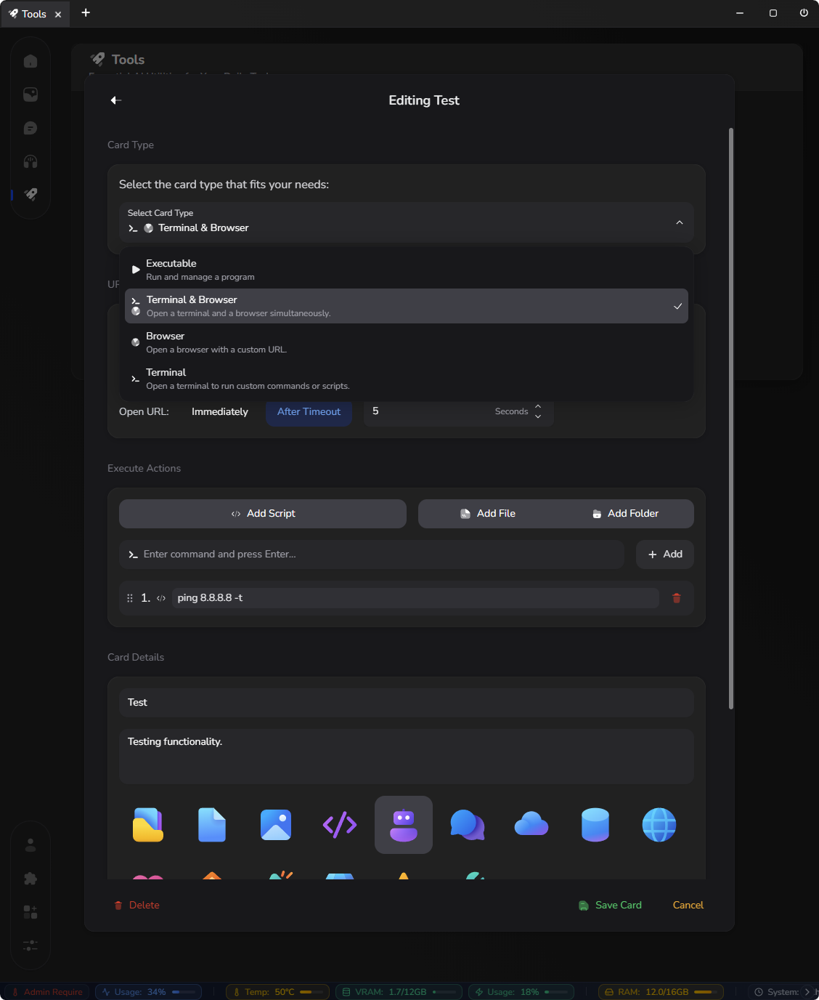

  

# [LynxHub](https://github.com/KindaBrazy/LynxHub) Custom Actions

A powerful extension for the [LynxHub](https://github.com/KindaBrazy/LynxHub) application that allows you to create,
manage, and execute custom action cards. Build your own command center to automate scripts, launch applications, open
websites, and streamline your entire workflow with a single click.

## ✨ Key Features

- 🎨 **Visually Rich Cards**: Design beautiful cards with custom titles, descriptions, icons, and accent colors.
- 🚀 **Powerful Card Types**: Choose from four distinct card types to match your needs: `Executable`, `Terminal`,
  `Browser`, or a hybrid `Terminal & Browser`.
- 🔗 **Chainable Actions**: Execute multiple actions in sequence—run a script, open a project folder, and launch a local
  server, all with a single click.
- ⚙️ **Advanced Configuration**:
    - Run any executable file.
    - Execute shell scripts (`.bat`, `.sh`, `.ps1`) and custom commands.
    - Open any file or folder on your system.
    - Launch a browser view to a specific URL, either immediately or after a configurable timeout.
- 🗂️ **Smart Categorization**: Add your cards into LynxHub categories like Pinned, Recently Used, or context-specific
  pages (Image, Text, Audio).
- 🪄 **Intuitive UI**: A seamless and animated management modal for creating, editing, and deleting your custom cards.

## Installation

1. **[Install LynxHub](https://github.com/KindaBrazy/LynxHub):** Ensure that you have LynxHub installed on your system.
2. **Install Extension:** Install the Custom Actions Extension from the LynxHub plugins page.

___

## 📄 License

This project is licensed under the MIT License. See the [LICENSE.md](LICENSE.md) file for details.